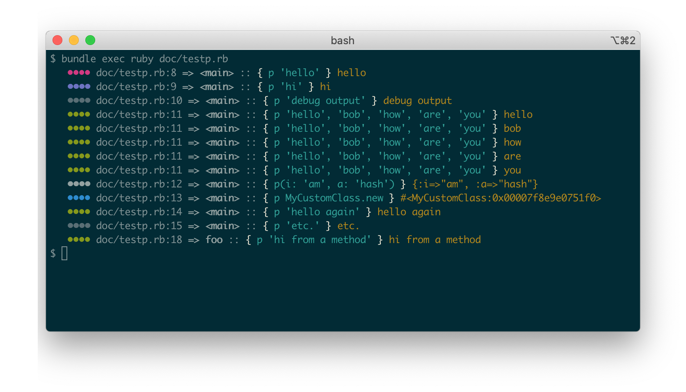

# betterp

## Overview

_betterp_ emulates  _Ruby_'s default `p` with a few extra goodies.

The standard `Kernel#p` method is overwritten with a version that provides the following features:

* All output is prefixed with the file and line number that made the call to `p`
* The output prefix is colourised. The colour is selected using a hash of the file path and line number so the colours are stable between each run.

The original semantics of `Kernel#p` are still applied, i.e. it returns the value(s) passed to it and the result of `#inspect` on each argument is output to a separate line.

## Installation

Add the gem to your `Gemfile`

```ruby
gem 'betterp', '~> 0.1.6'
```

And rebuild your bundle:

```bash
$ bundle install
```

Or install standalone:
```bash
$ gem install betterp -v '0.1.6'
```

## Usage

Call `p` from anywhere in your code just as you normally would:

```ruby
require 'betterp'

p 'hello'
```



## Contributing

Bug reports and pull requests are welcome on GitHub at https://github.com/bobf/betterp

## License

[MIT License](LICENSE)
